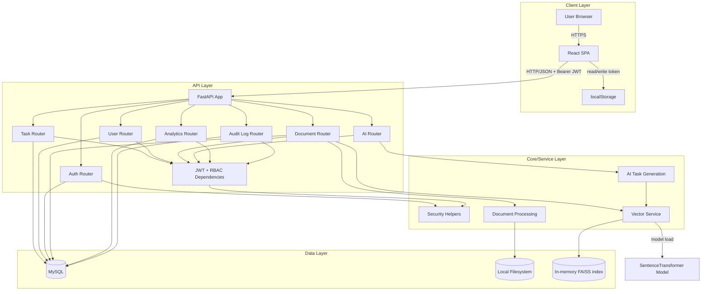

# High-Level Design (HLD) — AI Task & Knowledge Management Engine

## 1) Title & Metadata

| Field | Value |
|---|---|
| Repository | `NikithaJoshy/ai_task_management` |
| Last updated | 2026-09-10 |
| Doc owner | Not determined from repository |
| Source baseline | `README.md`, `backend/`, `frontend/`, dependency manifests, Alembic config |

## 2) Executive Overview

Full-stack task and knowledge management platform composed of:
- React SPA (`frontend/`) for authentication, task workflows, document workflows, analytics, and audit viewing.
- FastAPI backend (`backend/app/`) for auth, task CRUD, document ingestion/search, AI-assisted task generation, analytics, and audit access.
- MySQL via SQLAlchemy for operational records.
- Local vector search (FAISS + sentence-transformers) and local file storage for uploaded documents.

## 3) Objective

Provide authenticated users with:
- Task lifecycle management.
- Document upload/search for knowledge retrieval.
- AI-assisted task drafting.
- Operational analytics and admin audit visibility.

## 4) Architecture Description

## 5) Core Workflows

- Authentication: `POST /auth/login` validates credentials, logs `LOGIN`, returns JWT and basic user info.
- Task management: authenticated users create, view, filter, update, and delete tasks they created or are assigned to; assignment validates that the assignee is active.
- Document knowledge flow: upload PDF/TXT -> store file locally -> extract text -> chunk text -> create embeddings -> search similar content.
- AI task generation: authenticated user submits a natural-language prompt -> backend derives title, priority, and due date patterns -> adds retrieved vector context -> returns structured task draft.
- Audit and analytics: activity logs are persisted in MySQL and later read by analytics and audit endpoints.

## 6) Data Flow

- Credentials and task/document payloads originate from SPA API calls.
- JWT travels in the `Authorization` header and is stored in browser `localStorage`.
- Structured entities are persisted to MySQL (`users`, `tasks`, `activity_logs`, `documents`).
- Uploaded document binaries are stored under `uploads/documents`; extracted/chunked text vectors are stored in in-memory FAISS process state.
- Analytics reads task and activity-log aggregates; audit endpoint returns activity log rows.

## 7) Key Features

- JWT authentication with backend-enforced authorization.
- Admin-only user creation and audit-log access.
- Task CRUD with ownership/assignment filtering.
- Document upload, listing, and semantic search.
- AI-assisted task generation endpoint.
- Operational analytics and audit logging.

## 8) Infrastructure & Deployment Overview

- Runtime topology: separately started backend (Uvicorn) and frontend (Vite dev server).
- Database: external MySQL expected via `DATABASE_URL`.
- CORS: backend allows local frontend origins on ports 5173 and 5174.
- Vector search dependencies: local process memory plus sentence-transformers model download at runtime.
- CI/CD, containerization, and IaC: Not determined from repository.

## 9) Deployment Strategy

- Documented deployment is local/manual:
  - Backend: `uvicorn app.main:app --reload`.
  - Frontend: `npm run dev`.
- Branching/release strategy and automated promotion pipeline: Not determined from repository.

## 10) Data Protection

- Data in transit: browser-to-API communication uses HTTP requests with Bearer JWT authorization headers; local dev origins are explicitly allowed by CORS.
- Data at rest: MySQL stores user, task, document metadata, and activity logs; uploaded files are stored on the local filesystem.
- In-memory processing: vector embeddings and chunk metadata are held in process memory and are not persisted to a database.
- Secrets management: `DATABASE_URL` is loaded from `.env`; `SECRET_KEY` is currently hardcoded in backend security code and should be treated as a manual-review item; `AI_API_KEY` is declared in settings but active use is not determined from repository.
- LLM / third-party sharing: not determined from repository beyond local sentence-transformer model usage.
- Logging and retention: activity logs are written for key actions, but retention policy is not determined from repository.

## 11) Security Requirements

- Authentication uses JWT bearer tokens validated by backend dependencies.
- Authorization is enforced server-side through user and admin dependency checks.
- Inactive accounts are rejected by the user dependency.
- Task ownership is enforced by filtering reads and updates to tasks created by or assigned to the current user.
- Passwords are hashed before persistence.
- Dependency posture: the repository pins FastAPI, SQLAlchemy, PyJWT, PyMySQL, sentence-transformers, FAISS, and PDF libraries; specific vulnerability status is not determined from repository.
- Security flag: `backend/app/core/security.py` contains a hardcoded `SECRET_KEY` value and should be replaced with an environment-backed secret.

## 12) Integrations

| Integration | Purpose | Auth mechanism |
|---|---|---|
| MySQL (`DATABASE_URL`) | Persistence for user, task, document, and activity metadata | DB credentials in connection URL (env provided). |
| React browser client | Frontend application consuming the API | JWT bearer token in `Authorization` header. |
| SentenceTransformer model (`all-MiniLM-L6-v2`) | Embedding generation for semantic search | Library-managed model load; auth not applicable. |
| Local filesystem (`uploads/documents`) | Store uploaded document binaries | Not applicable. |

## 13) Environment Variables & Secrets Inventory

| Name | Usage |
|---|---|
| `DATABASE_URL` | SQLAlchemy engine connection string (`backend/app/database.py`). |
| `AI_API_KEY` | Declared in settings model (`backend/app/core/config.py`); active use not determined in current code path. |
| `SECRET_KEY` | Hardcoded constant in `backend/app/core/security.py`; should be externalized to an environment variable. |
| `ALGORITHM` | JWT signing algorithm constant (`backend/app/core/security.py`). |
| `ACCESS_TOKEN_EXPIRE_MINUTES` | JWT expiration constant (`backend/app/core/security.py`). |

## 14) Change Log

- **2026-09-10**: Updated `docs/HLD.md` after repository review. Refined architecture, workflows, integrations, security notes, and environment inventory to reflect backend/frontend code paths, CORS settings, document storage, in-memory vector indexing, and the hardcoded JWT secret requiring manual review.
