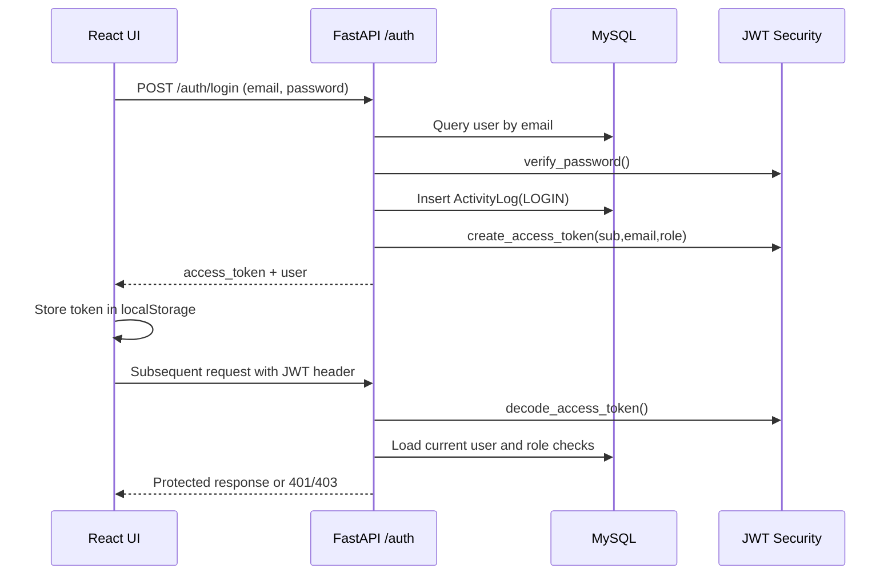
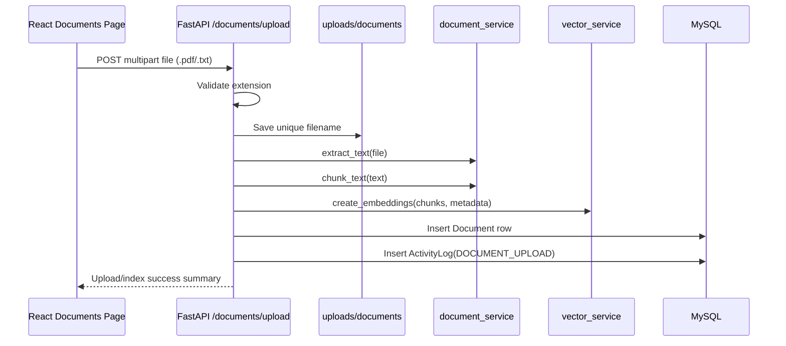
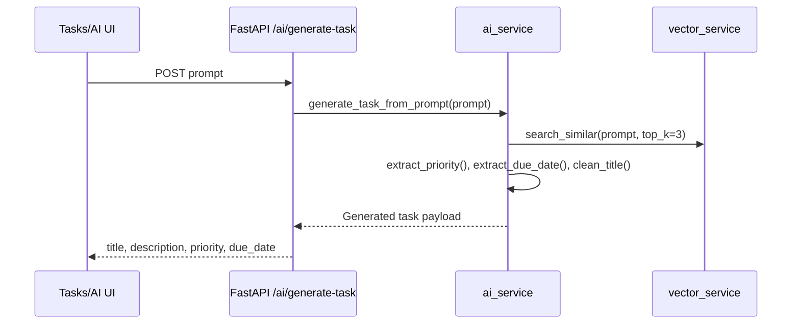

# Low-Level Design (LLD) — AI Task & Knowledge Management Engine

## 1) Title & Metadata

| Field | Value |
|---|---|
| Repository | `NikithaJoshy/ai_task_management` |
| Last updated | 2026-09-10 |
| Doc owner | Not determined from repository |

## 2) Module/Component Breakdown

### Backend (`backend/app`)

- **`main.py`**: FastAPI bootstrap, CORS configuration, router registration.
- **`database.py`**: env-backed SQLAlchemy engine/session and request-scoped DB dependency.
- **`core/security.py`**: password hashing, JWT encode/decode.
- **`core/dependencies.py`**: `get_current_user` and `get_current_admin` authorization gates.
- **Routers**:
  - `auth.py`: login and token issue.
  - `user.py`: admin-only user create/list.
  - `task.py`: task CRUD with ownership and assignment logic.
  - `document.py`: upload, list, search, view, download; activity logging.
  - `ai.py`: AI task-generation endpoint.
  - `analytics.py`: aggregate task/search metrics.
  - `audit_log.py`: admin audit log listing.
- **Services**:
  - `document_service.py`: PDF/TXT extraction, fixed-size word chunking.
  - `vector_service.py`: embedding generation and FAISS in-memory similarity search.
  - `ai_service.py`: prompt parsing + vector context composition for generated task output.

### Frontend (`frontend/src`)

- **`services/api.js`**: Axios client, token injection interceptor, `401` handling.
- **`App.jsx`**: Router map and protected-route wrapper.
- **Pages/components**: `Login`, `Dashboard`, `Tasks`, `Documents`, `Analytics`, `AuditLogs`, `AITaskGenerator`.

## 3) Key Classes / Functions

| Item | Purpose | Inputs -> Outputs | Side effects |
|---|---|---|---|
| `create_access_token` (`core/security.py`) | JWT issue | claims dict -> JWT string | Uses static `SECRET_KEY`, sets expiry. |
| `get_current_user` (`core/dependencies.py`) | AuthN/AuthZ guard | bearer token + DB session -> `User` | DB lookup; raises 401/403. |
| `create_task` (`routers/task.py`) | Task creation | `TaskCreate` + user context -> `TaskResponse` | Inserts task + activity log, commits transaction. |
| `update_task` (`routers/task.py`) | Task patch/update | `task_id`, `TaskUpdate` -> `TaskResponse` | Validates assignee; logs status transition action. |
| `upload_document` (`routers/document.py`) | Ingest knowledge document | multipart file -> upload/index metadata | Writes file, extracts/chunks, indexes vectors, inserts DB document/activity row. |
| `search_documents` (`routers/document.py`) | Semantic retrieval | query/top_k -> result list | Logs search activity row. |
| `generate_task_from_prompt` (`services/ai_service.py`) | AI-assisted draft task | prompt -> `{title, description, priority, due_date}` | Calls vector search; enriches description with retrieved content. |
| `create_embeddings` / `search_similar` (`services/vector_service.py`) | Vector indexing/retrieval | chunks/query -> embeddings/results | Maintains process-global FAISS index and in-memory chunk metadata. |

## 4) Data Models / Schemas

### Database entities

| Table / model | Fields (determinable) |
|---|---|
| `users` | `id`, `name`, `email` (unique), `password_hash`, `role`, `is_active`, `created_at` |
| `tasks` | `id`, `title`, `description`, `status`, `priority`, `due_date`, `assigned_to` (FK users), `created_by` (FK users), `created_at`, `updated_at` |
| `activity_logs` | `id`, `user_id` (FK users, nullable), `action`, `details`, `created_at` |
| `documents` (ORM model) | `id`, `filename`, `original_filename`, `file_path`, `file_size`, `uploaded_by` (FK users), `created_at` |

### API schemas (selected)

- `LoginRequest`: `email`, `password`.
- `TokenResponse`: `access_token`, `token_type`, nested user (`id`, `email`, `role`).
- `TaskCreate` / `TaskUpdate`: title/description/status/priority/due_date/assigned fields.
- `DocumentSearchRequest`: `query`, `top_k`.
- `AITaskRequest` / `AITaskResponse`: prompt and generated task attributes.

## 5) Sequence Diagrams (key workflows)

### A) Login and authenticated request

### B) Document upload and indexing

### C) AI-assisted task generation

## 6) Error Handling & Retry Behavior

- Backend uses `HTTPException` for domain errors (400/401/403/404/500 depending on endpoint).
- Document upload rolls back DB changes and removes partially written file on processing failure.
- Frontend captures API failures, renders user-facing messages, and clears auth state on `401`.
- Explicit backend retry/backoff policies for DB/vector/model operations: Not determined from repository.

## 7) Configuration & Environment-Specific Behavior

- `DATABASE_URL` is mandatory at startup for backend DB engine.
- `.env` loading enabled via `python-dotenv` and `pydantic-settings` usage.
- CORS allowlist limited to localhost frontend ports in backend middleware.
- Frontend API base URL is hardcoded to `http://127.0.0.1:8000`.
- Separate local startup commands (`uvicorn`, `vite`) define development runtime.

## 8) Known Limitations / Technical Debt

- JWT secret and token settings are hardcoded in code instead of env-driven config.
- Vector index and chunk metadata are in-process memory only; restart loses retrieval state.
- Alembic migrations in repository include users/tasks/activity_logs; document table migration is not present in checked revisions.
- Document authorization model does not scope list/view/download by `uploaded_by`.

## 9) Change Log

- **2026-09-10**: Bootstrapped `docs/LLD.md` with module decomposition, key function contracts, data model summary, Mermaid sequence diagrams, and implementation-observed limitations.
